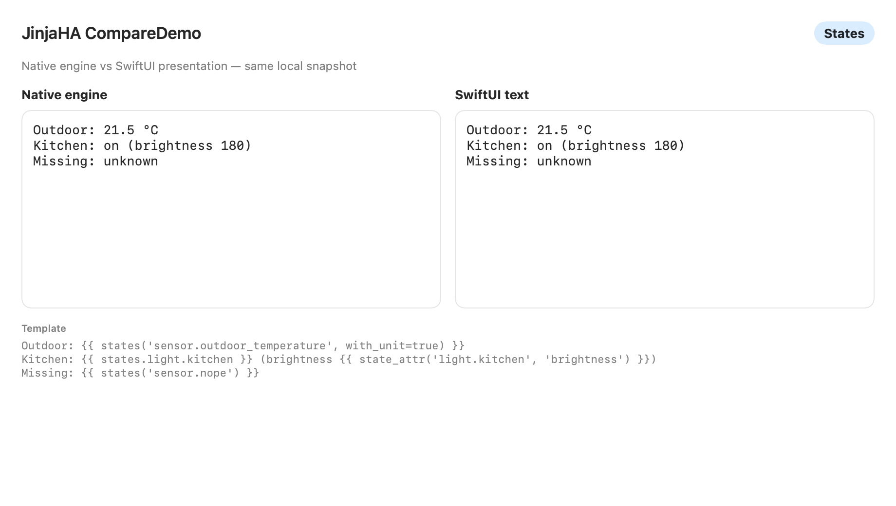
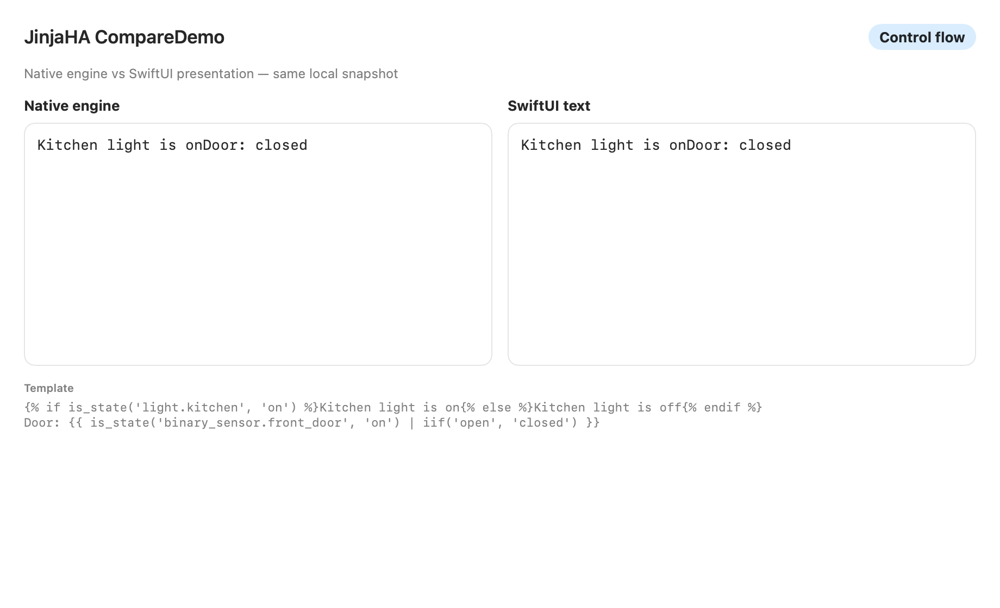
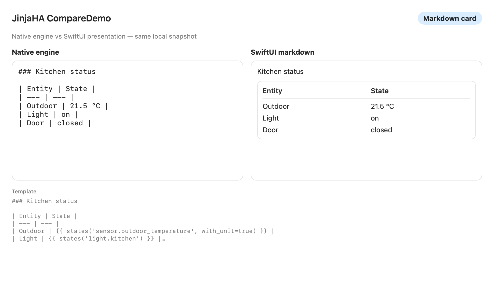
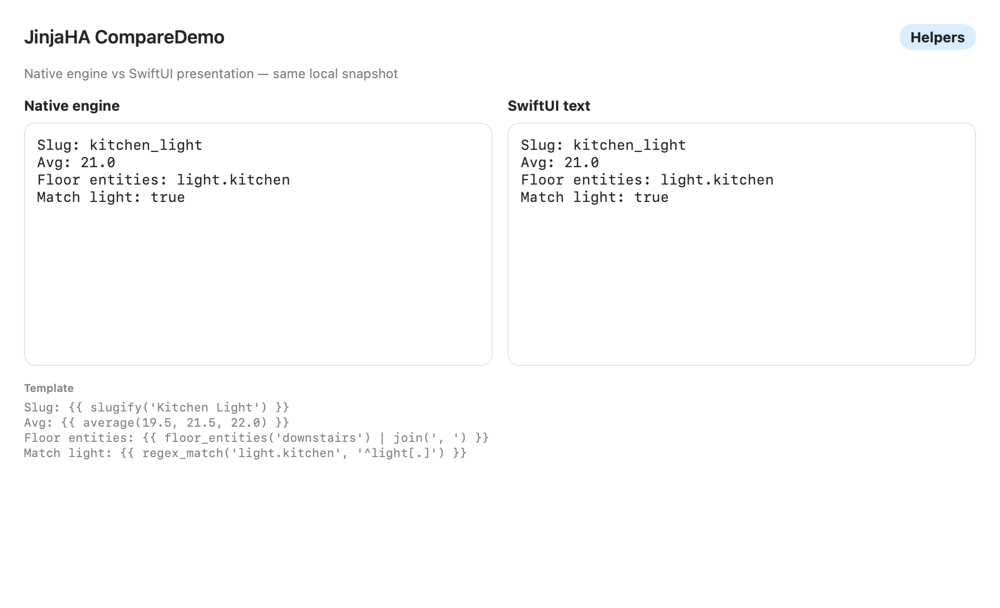

# JinjaHA

Swift library for evaluating **Home Assistant Jinja2** templates on Apple platforms, with an optional SwiftUI presentation layer.

Use it in apps that connect to Home Assistant and render Lovelace dashboards (iOS, tvOS, macOS, watchOS).

The Jinja2 runtime is **owned** as `JinjaCore` (vendored baseline from huggingface/swift-jinja 2.4.2, Apache-2.0 — see `NOTICE`). There is no runtime dependency on huggingface. See [`Docs/COMPAT.md`](Docs/COMPAT.md) and [`Docs/FEATURES.md`](Docs/FEATURES.md).

**GitHub:** [iHadAThought/JinjaHA](https://github.com/iHadAThought/JinjaHA)

## Products

| Product | Purpose |
|---------|---------|
| **JinjaCore** | Owned Jinja2 engine (lexer/parser/runtime, registries, loader, attribute policy) |
| **JinjaHA** | HA snapshot helpers + REST `/api/template` client on top of JinjaCore |
| **JinjaHASwiftUI** | `HATemplateText` / `HATemplateMarkdown` with last-good-render semantics |

## Install

```swift
dependencies: [
    .package(url: "https://github.com/iHadAThought/JinjaHA.git", from: "0.3.0")
]
```

```swift
.target(
    name: "MyApp",
    dependencies: [
        .product(name: "JinjaHA", package: "JinjaHA"),
        .product(name: "JinjaHASwiftUI", package: "JinjaHA"),
    ]
)
```

## Hybrid app pattern

JinjaHA is designed as an **independent library**. Your app owns the HA connection and fills `HAStateSnapshot` (entities, registries, TZ, home lat/lon, optional `entityMeta` / repairs / translations). Rendering stays:

1. **Local** — `LocalTemplateRenderer(snapshot:)` for documented HA Jinja
2. **Fallback** — `FallbackTemplateRenderer` → `HAAPITemplateRenderer` for HACS / custom Python / anything local cannot evaluate

```swift
let local = LocalTemplateRenderer(snapshot: snapshot)
let api = HAAPITemplateRenderer(baseURL: haURL, token: token)
let hybrid = FallbackTemplateRenderer(primary: local, fallback: api)
let rendered = try await hybrid.render(template)
```

See [`Docs/FEATURES.md`](Docs/FEATURES.md) for the helper matrix and permanent API-fallback boundary (TD-009).

## Quick start

```swift
import JinjaHA

let snapshot = HAStateSnapshot(
    entities: [
        "sensor.temp": HAEntityState(
            entityID: "sensor.temp",
            state: "22",
            attributes: ["unit_of_measurement": .string("°C")]
        )
    ]
)

let engine = HATemplateEngine(snapshot: snapshot)
let text = try engine.render("{{ states('sensor.temp') }} °C")
// "22 °C"
```

### SwiftUI

```swift
import JinjaHASwiftUI

HATemplateMarkdown(
    template: markdownCardContent,
    renderer: local,
    refreshToken: "\(statesRevision)"
)
```

## Screenshots

Side-by-side native engine vs SwiftUI presentation (`Examples/CompareDemo`):

| States | Control flow |
|--------|----------------|
|  |  |

| Markdown card | Helpers |
|---------------|---------|
|  |  |

Regenerate:

```bash
swift run CompareDemo --export-screenshots Docs/screenshots
```

## Feature matrix

| Area | Support |
|------|---------|
| Jinja2 expressions / `if` / `for` / `set` / `macro` / `do` / `debug` / `trans` | Local (`JinjaCore`) |
| `` / `` / `` / `` / import | Local (`JinjaCore`; loader required for include/extends) |
| `states()`, `is_state`, `is_state_attr`, `state_attr`, `has_value` | Local |
| Dotted `states.domain.object` (+ print → state) | Local |
| Registry: `is_hidden_entity`, `entity_name`, `integration_entities`, `config_entry_*` | Local (from `entityMeta` / `configEntries`) |
| Repairs / translations | Local (`repairIssues` / `translationStrings`) |
| Encoding: `pack`/`unpack`/`from_hex`/`sha1`/`sha512`/… | Local |
| Math / functional / set ops (`clamp`, `zip`, `union`, …) | Local |
| Areas / devices / floors / labels helpers | Local (from `HAStateSnapshot` registries) |
| Datetime (`now`, `utcnow`, `as_timestamp`, `timedelta`, `strftime`, …) | Local |
| `to_json` / `from_json` | Local |
| `POST /api/template` hybrid fallback | `FallbackTemplateRenderer` |
| HACS / custom Jinja / arbitrary Python methods | Permanent API-fallback |

## Security

- Template / output byte caps and `range()` size limits (`HATemplateLimits`)
- Optional render timeout
- Default deny-all `TemplateLoader` (no filesystem includes unless you install an allowlist)
- `AttributePolicy` blocks `_`-prefixed attribute access by default
- API client never logs the bearer token; error bodies scrub the token

## Documentation

| Guide | Path |
|-------|------|
| Overview | [`Docs/guide/00-overview.md`](Docs/guide/00-overview.md) |
| Architecture | [`Docs/guide/01-architecture.md`](Docs/guide/01-architecture.md) |
| Setup | [`Docs/guide/02-setup.md`](Docs/guide/02-setup.md) |
| Roadmap | [`Docs/guide/03-roadmap.md`](Docs/guide/03-roadmap.md) |
| Compatibility | [`Docs/COMPAT.md`](Docs/COMPAT.md) |
| Feature backlog | [`Docs/FEATURES.md`](Docs/FEATURES.md) |

## Examples

```bash
# CLI render smoke test
swift run MinimalRender

# macOS side-by-side demo (native Text vs SwiftUI)
swift run CompareDemo
```

## Tests

```bash
swift test
Scripts/check-compat-notes.sh
```

Optional live parity (compares local vs HA API):

```bash
HA_URL=https://homeassistant.local:8123 HA_TOKEN=xxxxx swift test --filter LiveParityTests
```

## Upstream compatibility

See [`Docs/COMPAT.md`](Docs/COMPAT.md) and [`Compatibility/TRACKED_DIFFERENCES.md`](Compatibility/TRACKED_DIFFERENCES.md). When Pallets Jinja or HA template functions change: add failing goldens under `Compatibility/`, implement, then bump **Last reviewed**.

## License

Apache 2.0
